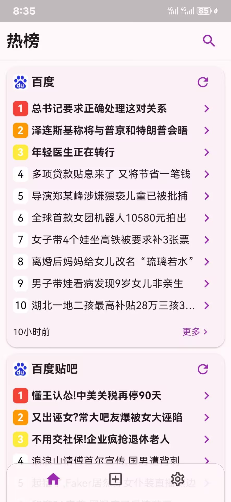
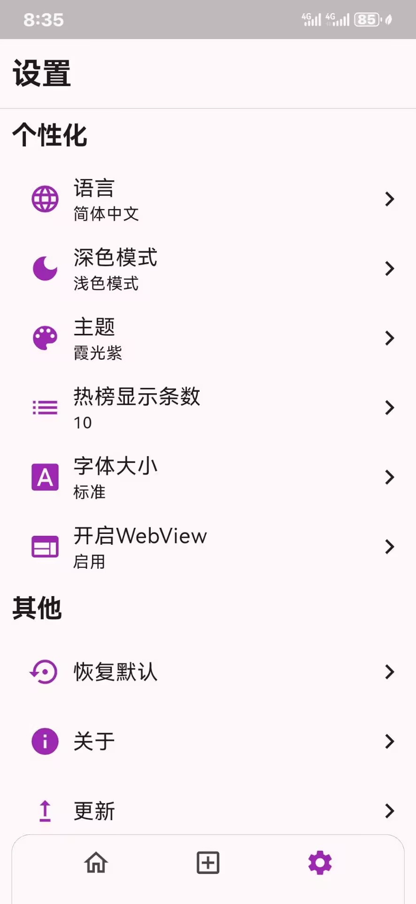
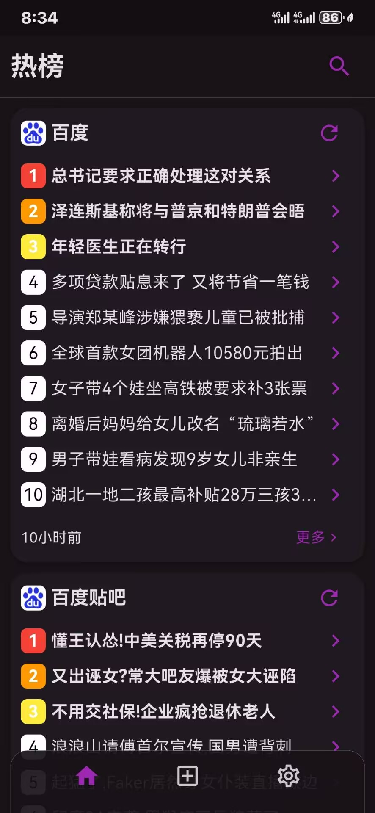
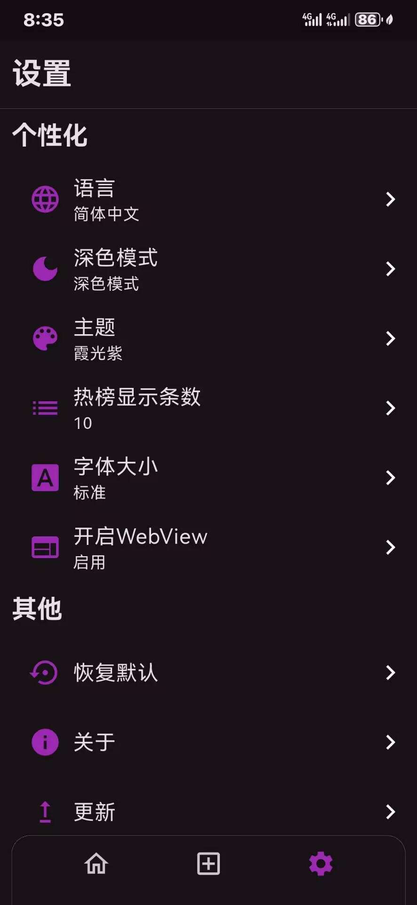
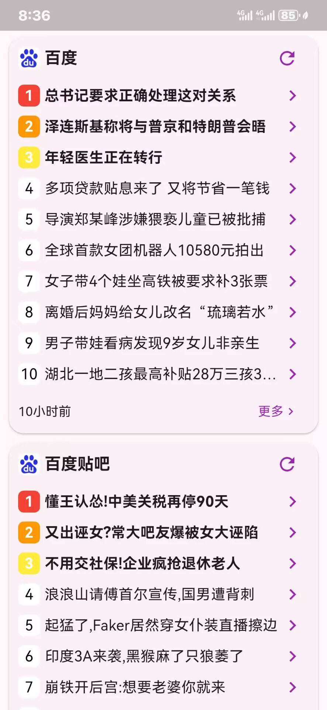
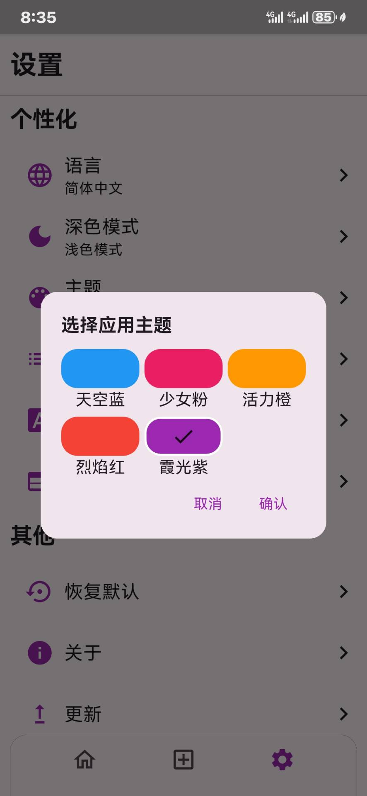
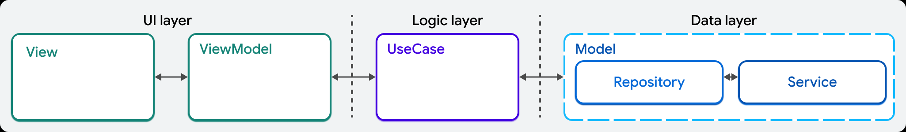
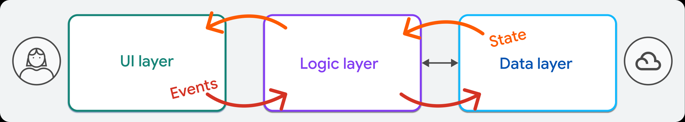
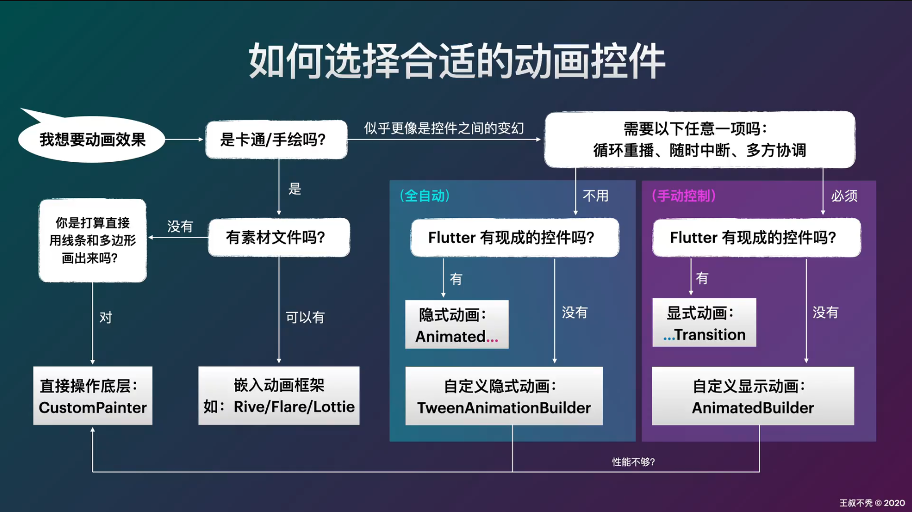

# flnews--新闻聚合应用 简介

## 概述

### 简介

这是一个基于[Flutter](https://flutter.cn/)框架的新闻聚合应用。应用使用[XPath](https://baike.baidu.com/item/XPath/5574064)获取多个网站热门信息。灵感来源：[nowinnews](https://github.com/QCuncle/nowinnews)。

* [X] 获取主流网站热榜新闻
* [X] 沉浸式浏览（隐藏导航栏）
* [X] 支持国际化（中英文）
* [X] 深色模式切换
* [X] 多种主题可选
* [X] 自定义热榜显示条数
* [X] 自定义字体大小
* [X] 重置订阅配置
* [ ] 查看新闻详情
* [ ] 查看站点更多新闻
* [ ] 搜索订阅站点新闻
* [ ] 自动开启WebView

<p align = "center">








</p>

### 项目目录介绍

```cmd
lib
│   main.dart
│
├───config
│       assets.dart
│       dependencies.dart
│
├───data
│   ├───repositories
│   │   ├───site
│   │   │       default_xpath_processor.dart
│   │   │       site_repository.dart
│   │   │
│   │   └───site_config
│   │           site_config_repository.dart
│   │
│   └───services
│       ├───api
│       │       api_client_service.dart
│       │
│       └───local
│           │   local_database_service.dart
│           │
│           └───database
│               ├───connection
│               │       native.dart
│               │
│               ├───db
│               │       database.dart
│               │       database.g.dart
│               │
│               └───tables
│                       sites_config_table.dart
│                       sites_table.dart
│
├───domain
│   ├───models
│   │   ├───news
│   │   │       news.dart
│   │   │       news.freezed.dart
│   │   │       news.g.dart
│   │   │
│   │   ├───news_xpath
│   │   │       news_xpath.dart
│   │   │       news_xpath.freezed.dart
│   │   │       news_xpath.g.dart
│   │   │
│   │   ├───site
│   │   │       site.dart
│   │   │       site.freezed.dart
│   │   │       site.g.dart
│   │   │
│   │   └───site_config
│   │           site_config.dart
│   │           site_config.freezed.dart
│   │           site_config.g.dart
│   │
│   └───use_cases
├───global
│   │   states.dart
│   │
│   └───variable
│       │   global.dart
│       │
│       └───profile_model
│               profile.dart
│               profile.g.dart
│
├───routing
│       router.dart
│       routes.dart
│
├───ui
│   │   scaffold.dart
│   │   scaffold_viewmodel.dart
│   │
│   ├───core
│   │   ├───l10n
│   │   │       app_en.arb
│   │   │       app_localizations.dart
│   │   │       app_localizations_en.dart
│   │   │       app_localizations_zh.dart
│   │   │       app_zh.arb
│   │   │
│   │   ├───themes
│   │   │       themes.dart
│   │   │
│   │   └───ui
│   │           bottom_bar.dart
│   │           top_bar.dart
│   │
│   ├───hot
│   │   ├───view_models
│   │   │       hot_viewmodel.dart
│   │   │
│   │   └───widgets
│   │           hot_screen.dart
│   │           news_card.dart
│   │
│   ├───settings
│   │   ├───view_models
│   │   │       settings_viewmodel.dart
│   │   │
│   │   └───widgets
│   │           about_dialog.dart
│   │           dark_mode_dialog.dart
│   │           font_size_dialog.dart
│   │           hot_counts_dialog.dart
│   │           locale_dialog.dart
│   │           restore_dialog.dart
│   │           settings_screen.dart
│   │           theme_dialog.dart
│   │           update_dialog.dart
│   │
│   └───subscribe
│       ├───view_models
│       │       subscribe_viewmodel.dart
│       │
│       └───widgets
│               subscribe_screen.dart
│
└───utils
        command.dart
        result.dart
```

* **config/**

  * assets.dart里存放资源文件路径。
  * dependencies.dart里注入项目依赖，比如数据层仓库和服务，以及数据库类和全局状态类。
* **data/**

  * 数据层包括仓库和服务。
  * 应用包括两个仓库，`site`仓库和 `site_config`仓库。前者负责从本地（数据库）或api服务获取并处理网站原始新闻数据并向ui层暴露获取处理后新闻的接口，后者负责从本地（数据库）服务获取网站设置信息。这两个仓库同时还提供有限的修改本地数据库的能力。
  * 应用包括api服务和本地服务。api服务从网站获取html文件，可以由仓库调用后解析其新闻数据；本地服务包括一个[drift](https://drift.simonbinder.eu/)数据库和操作数据库的接口。
* **domain/**

  * 领域层包括应用数据模型和用例。
  * 应用数据模型有新闻、新闻在html中的XPath、网站、网站设置。网站数据模型包括新闻和其他数据，网站设置数据模型包括新闻在html中的XPath和其他数据。应用使用网站数据模型为热榜页面提供数据模版，使用网站设置数据模型为订阅页面提供数据模版。
  * 用例在应用中暂未使用。
* **global/**

  * 包括全局变量和全局状态。
  * 全局变量和全局状态都可以在应用任何位置调用，但是前者的改变不会引起ui重绘，后者的改变会引起ui重绘。
* **routing/**

  * 应用路由信息，包括定义路由名称和创建路由。
* **ui/**

  * ui层包含各个页面的view和viewmodel，以及主题、国际化、通用组件，还包括应用的自定义框架。
* **utils/**

  * 存放有关命令模式的工具。
* **main.dart**

  * 应用主文件，包含全局变量初始化、主题配置、本地化配置。

## 应用架构

应用使用官方推荐的[MVVM](https://docs.fluttercn.cn/app-architecture)架构即Model-View-ViewModel结构，将应用代码分为数据层、领域层、ui层。



ui层，一个View应该只对应一个ViewModel，这里的View指一屏（screen）的ui，如果View使用了其他自定义组件（Widget）这些组件应该尽量少包含逻辑，如果确实需要包含比较复杂的逻辑，应该在ViewModel中定义，并使用构造函数入参传入组件。领域层是可选的，ViewModel使用用例从仓库获取数据。数据层仓库和服务是一对多的关系，即一个仓库可以使用多个服务来整合数据。

在MVVM架构中，只有相邻两层有数据交换。比如，View只能从ViewModel得到数据，ViewModel只能从UseCase或者仓库得到数据，服务只能让仓库调用来得到原始数据。而不是让View直接从仓库或者服务得到数据。



## 状态管理

应用使用官方状态管理包[Provider](https://pub.dev/packages/provider)管理应用状态。

在本应用中使用Provider主要如下作用：

### 注入依赖

在[dependencies.dart](lib\config\dependencies.dart)中使用Provider注入应用所需数据库、仓库、全局状态依赖：

```dart
Provider(
  create: (context) => AppDatabase(),
  dispose: (context, db) => db.close(),
),
Provider(create: (context) => ApiClientService()),
Provider(
  create: (context) => LocalDatabaseService(databaseSvc: context.read()),
),
Provider(
  create:
      (context) => SiteRepository(
        apiClientSvc: context.read(),
        localDatabaseSvc: context.read(),
      ),
),
Provider(
  create:
      (context) => SiteConfigRepository(localDatabaseSvc: context.read()),
),
ChangeNotifierProvider(create: (context) => GlobalState())
```

这样做的好处在于，数据库、仓库、全局状态类只有一个实例，不会出现有多个同一类型实例引起数据不一致的冲突。

在需要传入上述依赖的入参可以直接使用 `context.read()`得到所需依赖，比如在[scaffold.dart](lib\ui\scaffold.dart)中，创建页面实例时：

```dart
final List<Widget> pages = [
  HotScreen(viewModel: HotViewModel(siteRepository: context.read())),
  SubscribeScreen(
    viewmodel: SubscribeViewModel(siteConfigRepository: context.read()),
  ),
  SettingsScreen(viewmodel: SettingsViewModel()),
];
```

### 管理全局状态

[全局状态](https://book.flutterchina.club/chapter15/globals.html#_15-4-1-%E5%85%A8%E5%B1%80%E5%8F%98%E9%87%8F-global%E7%B1%BB)指在整个程序生命周期内存在的状态，可以给多个组件共享。Flutter框架中的主题和国际化也可以看做是全局状态。

本应用中的全局状态有主题颜色、深色模式、字体大小、应用语言、热榜卡片展示新闻条数。为这些数据创建数据模型[profile.dart](lib\global\variable\profile_model\profile.dart)，将其和其他全局变量保存在[global.dart](lib\global\variable\global.dart)中的 `Global`静态类中供其他组件或页面调用。`Profile`类中的数据为用户偏好，应该将其持久化。对于这类少量的用户偏好数据，可以使用[shared_preferences](https://pub.dev/packages/shared_preferences)将其作为键值对存储于磁盘。

将[global.dart](lib\global\variable\global.dart)中有必要作为全局状态的变量（本应用中有 `profile`和 `barHeight`）通过 `Global.xx`在[states.dart](lib\global\states.dart)中获取，并为其设置 `getter/setter`属性让其作为全局状态。值得注意的是，[states.dart](lib\global\states.dart)中的 `GlobalState`类继承自 `ChangeNotifier`，并且它的 `notifyListeners()`函数被重写加上了保存至[shared_preferences](https://pub.dev/packages/shared_preferences)的持久化功能。这样全局状态类 `GlobalState`就有了状态更改自动通知监听者同时自动持久化最新状态的能力。

对于全局状态的使用，有两种方法：

* 使用 `Consumer<T>`。这种方法只会重建传入其 `builder`参数的组件。
* 使用 `var global = Provider.of<T>(context)`。这种方法会重建所有使用 `global`变量的组件。

在本应用中，由于全局状态需要在根组件上使用，所以上面两种方法效果一致。

有时，实际上不需要全局状态中的数据来改变ui，但确仍然需要访问它。在本应用中，除了在[main.dart](lib\main.dart)选择使用第二种方法使用全局状态，在其他地方使用全局状态实际上都不需要监听其改变，因为一旦全局状态改变将导致整个应用页面重绘，这时就不必再在其他组件上监听全局状态的改变了。所以，对于这种需要访问全局状态但却不希望监听其改变的情况，可以使用 `Provider.of<T>(context, lister: false)`取消对状态改变的监听。

### 状态提升

在应用中，底部导航栏和顶部信息栏常驻于页面，也就是说底部栏和顶部栏独立于各个页面。应用在[scaffold.dart](lib\ui\scaffold.dart)中创建 `CustomScaffold`组件使用 `Stack`布局将顶栏和底栏固定在屏幕上，通过 `PageView`选择展示的页面。当应用展示首页热榜时，希望随着手指滑动新闻卡片可以逐渐隐藏和展示底栏与顶栏。但是热榜页面此时是 `CustomScaffold`的子组件，子组件的状态传递给父组件可以通过**回调函数**实现，比如在[font_size_dialog.dart](lib\ui\settings\widgets\font_size_dialog.dart)和[theme_dialog.dart](lib\ui\settings\widgets\theme_dialog.dart)中，子组件中的 `fontSize`和 `theme`不能立即赋值给全局状态中的相应变量，需要在父组件中按下确认按钮。在这种情况下，子组件需要将 `fontSize`和 `theme`传递给父组件用来赋值。这时可以通过回调函数让子组件调用父组件的函数传递需要传递的值。

但是，回调函数对于需要从许多不同地方修改的应用状态，将不得不传递大量的回调，这就会变得繁琐。并且回调函数会降低组件的通用性（因为有时只想单纯使用这个组件但却仍必须传入回调函数）。

这时，可以使用第二种方法：**状态提升**。具体来说，将子组件和父组件希望共同使用的状态单独放置在一个 `ChangeNotifier`中，在本应用中是[scaffold_viewmodel.dart](lib\ui\scaffold_viewmodel.dart)，并在其中实现改变这些状态的方法。现在只需要在子组件和父组件之上监听状态的改变就可以了。在本应用里是在 [scaffold.dart](lib\ui\scaffold.dart)中的 `CustomScaffold`类之上包裹 `<CustomScaffoldViewModel>`来实现的（当然也可以用 `var viewModel= Provider.of<CustomScaffoldViewModel(context)`）。依然可以用 `Provider.of<CustomScaffoldViewModel>(context).xx`获取状态和调用方法。

## 在Flutter中使用[drift](https://drift.simonbinder.eu/#welcome-to-drift)

drift 是一个易于使用的、响应式的、类型安全的持久化库，专门为 Dart 和 Flutter 设计。它构建在 SQLite 之上，提供了一套强大的 API，使得在 Dart 和 Flutter 应用中处理数据库变得更加简单和高效。

在应用中，使用drift将网站配置信息和新闻缓存持久化存储在磁盘上。

首先建立数据表。在应用中有两张表[sites_config_table.dart](lib\data\services\local\database\tables\sites_config_table.dart)和[sites_table.dart](lib\data\services\local\database\tables\sites_table.dart)。drfit内置了许多常用数据类型：

| Dart Type                                                                                                  | Drift Column                                                                                            | SQL Type[1](https://drift.simonbinder.eu/dart_api/tables/#fn:1)  |
| :--------------------------------------------------------------------------------------------------------- | :------------------------------------------------------------------------------------------------------ | :------------------------------------------------------------- |
| `int`                                                                                                    | `late final age = integer()()`                                                                        | `INTEGER`                                                    |
| `BigInt` (as 64-bit, see [why](https://drift.simonbinder.eu/dart_api/tables/#when-to-use-bigint-and-int64)) | `late final age = int64()()`                                                                          | `INTEGER`                                                    |
| `String`                                                                                                 | `late final name = text()()`                                                                          | `TEXT`                                                       |
| `bool`                                                                                                   | `late final isAdmin = boolean()()`                                                                    | `INTEGER` (`1` or `0`)                                   |
| `double`                                                                                                 | `late final height = real()()`                                                                        | `REAL`                                                       |
| `Uint8List`                                                                                              | `late final image = blob()()`                                                                         | `BLOB`                                                       |
| `DriftAny`                                                                                               | `late final value = sqliteAny()()`                                                                    | `ANY` (for `STRICT` tables)                                |
| `DateTime` (see [options](https://drift.simonbinder.eu/dart_api/tables/#datetime-options))                  | `late final createdAt = dateTime()()`                                                                 | `INTEGER`or `TEXT`                                         |
| Your own                                                                                                   | See[type converter docs](https://drift.simonbinder.eu/type_converters/).                                 | Depending on type                                              |
| Enums                                                                                                      | [`intEnum` or `textEnum`](https://drift.simonbinder.eu/type_converters/#implicit-enum-converters).   | `INTEGER` or `TEXT`                                       |
| Postgres Types                                                                                             | See[postgres docs](https://drift.simonbinder.eu/Platforms/postgres/).                                    | Depending on type                                              |

此外，drift还支持自定义类型。在[sites_config_table.dart](lib\data\services\local\database\tables\sites_config_table.dart)和[sites_table.dart](lib\data\services\local\database\tables\sites_table.dart)中都使用了自定义类型。要使用自定义类型，首先需要继承 `TypeConverter`类，然后重写 `formSql`和 `toSql`函数即可。

数据表建立完成后建立数据库。应用在[database.dart](lib\data\services\local\database\db\database.dart)中创建数据库。首先需要重写版本 `getter`和迁移 `getter`，在迁移 `getter` `get migration`里可以做初始化数据库的操作，然后实现创建数据库的函数，需要返回一个 `driftDatabase`，可以在这个函数中指定数据的名称、存放位置等。

drift支持[Selects（包括连接查询）](https://drift.simonbinder.eu/dart_api/select/)、[Writes（包括update, insert, delete，插入还包括更新插入upserts）](https://drift.simonbinder.eu/dart_api/writes/)、[Expressions](https://drift.simonbinder.eu/dart_api/expressions/)、[Stream queries](https://drift.simonbinder.eu/dart_api/streams/)等许多丰富的API。在应用中通过[local_database_service.dart](lib\data\services\local\local_database_service.dart)暴露数据库的API。

## 使用XPath解析html文档

XPath（全称：XML Path Language）是一种用于在 XML 或 HTML 文档中定位和筛选元素的语言。它通过提供一种路径表达式的方式，允许开发者精确地选择文档中的节点或元素。虽然 XPath 最初是为 XML 设计的，但它也广泛应用于 HTML 文档，特别是在自动化测试、Web 数据抓取和 Web 开发中。

**[xpath的一般写法](https://www.bilibili.com/opus/704942766364295192)：**`//*[ ]`  表示任意位置、任意的元素，[ ]内有两大类格式。也即 **定位有2种常用方式：** 通过属性类型或者文本内容。

* **使用等号=表示精确查找**

  * 利用属性：`//*[@属性='属性值'] `例如：`//*[@class='am-dropdown-toggle')]`其中class是属性名，'am-dropdown-toggle'是属性值
  * 利用文本：`//*[text()='文本值'] `例如：` //*[text()='人才招聘']`
* **使用contains进行模糊查询**

  * 利用属性模糊查询：` //*[contains(@href,'baidu`')]
  * 利用文本内容模糊查询：`//*[contains(text(),'院系专业')]`
    既支持属性又支持文本
* **使用开头的starts-with()进行模糊查询**

  当元素id是动态的，但总有一部分类似于前缀不变化，对于属性、文本内容都可以使用，匹配一个开始位置的关键字。

  * `//*[start-with(@id,'success')]`
  * `//*[start-with(text(),'练习')]`
    既支持属性又支持文本
* **上下级查询**

  有些元素没有任何属性

  
  

  例如：`//*[@type='password']/../..`
  通过前后的节点---包括同级、父节点来定位--即一级级的往上查找
  适用：寻找的元素不稳定，用它的上下级定位
* **多种条件精准查找**

  `//*[@class='mnav' `
* **特殊元素：** 例如图标、按钮等等

  

  svg元素直接复制xpath是不能定位的，直接写xpath的表达式是用到name属性去定位

  `//*[name()='svg']`

### 不使用WebView

在[api_client_service.dart](lib\data\services\api\api_client_service.dart)中，`getSiteHtml`函数尝试使用Dio库的 `get`方法直接请求网页html，然后将网页传入[default_xpath_processor.dart](lib\data\repositories\site\default_xpath_processor.dart)中处理获得需要的数据并组装成新闻实体。这种方法获取网页html的速度比较快，但是适用的网站比较少。

### 使用WebView

[WebView](https://pub.dev/packages/webview_flutter)是一个为 Flutter 提供 WebView 组件的插件。在 iOS 上，WebView 组件由 WKWebView 支持。在 Android 上，WebView 组件由 WebView 支持。

在[api_client_service.dart](lib\data\services\api\api_client_service.dart)中，`getRenderedSiteHtml`函数使用 `WebViewController`的 `loadRequest`方法先加载页面，然后使用 `runJavaScriptReturningResult`运行JS得到原始html。原始html需经过处理后才能被应用使用。这种方法适用大多数网站，但是得到html的耗时很长。

## [国际化](https://docs.flutter.cn/ui/accessibility-and-internationalization/internationalization/)

在项目根目录下创建一个[l10n.yaml](l10n.yaml)文件用于配置国际化。

```yaml
arb-dir: lib/ui/core/l10n
template-arb-file: app_en.arb
output-localization-file: app_localizations.dart
synthetic-package: false
```

* `arb-dir:`表示存放国际化文件夹的位置。
* 将英文的语言模板设定为 `app_en.arb`。
* 指定 Flutter 生成本地化内容到 `app_localizations.dart` 文件。
* `synthetic-package:`不使用Synthetic package的方式生成国际化资源文件。

然后可以继续在[l10n](lib\ui\core\l10n)目录下添加中文资源文件[app_zh.arb](lib\ui\core\l10n\app_zh.arb)。之后运行 `flutter pub get`即可自动生成 `.dart`国际化文件。

在[main.dart](lib\main.dart)中加入这两行：

```dart
localizationsDelegates: AppLocalizations.localizationsDelegates,
supportedLocales: AppLocalizations.supportedLocales,
```

## 动画（[Flutter 动画教程 序章 - 如何选择合适的动画控件](https://www.bilibili.com/video/BV1EV411C7Zq)）

**如何选择合适的动画？**



### 隐式动画

**命名：Animated...**

* 都有属性 `duration`来控制动画时长
* `AnimatedContainer`：可以控制 `Contanier`的 `height, width, color`等属性让 `Container`动起来
* `AnimatedSwitcher`：控制不同控件（也就是 `AnimatedSwitcher`的 `child`）之间切换的动画（比如淡入淡出）
  * 有 `transitionBuilder`属性，需要返回一个显示动画控件（命名为 `...Transiton`），默认返回 `FadeTransition`，可以自定义为 `ScaleTransition`等等
* `AnimatedOpacity/AnimatedPadding`：控制控件不透明度变化的动画/控制控件内边距变化的动画
  * 有 `curve`属性，控制动画曲线（比如线性、bounceInOut等）
* **万能的自定义动画 `TweenAnimationBuilder`**
  * 需要参数 `tween`
  * 需要参数 `builder`

比如在应用中[news_card.dart](lib\ui\hot\widgets\news_card.dart)文件里卡片的刷新按钮使用了隐式动画。

### 显示动画

**命名：...Transition**

* 都需要传入特定动画控制器 `AnimationController`
  * 有 `duration`参数，控制动画时长
  * 有 `vsync`参数，控制屏幕垂直同步
  * 可以指定 `lowerBound`和 `upperBound`参数来控制动画起始和结束值，也可以使用控制器连接 `Tween`来控制
    * 比如：`controller.drive(Tween(begin:0.0, end:1.0))`或者 `Tween(begin:0.0, end:1.0).animate(controller)`。后者可以使用 `chain`串联多个 `Tween`（类似于 `h(g(f(x)))`这样的符合函数），也可以串联 `CurveTween`，通过传入 `Interval`来控制动画开始的时间点，从而制作**交错动画**
* `RotationTransition`：旋转动画
* `FadeTransition`：淡入淡出动画
* `ScaleTransition`：缩放动画
* `SlideTransition`：移动组件动画
* **自定义动画 `AnimatiedBuilder`**
  * 需要参数 `animation`，即一个动画控制器
  * 需要参数 `builder`，即需要动画的组件
    * `builder`有一个 `child`参数，可用来优化性能，具体来说，如果在 `builder`里有始终不变化的组件，可以用将其传入 `child`参数，这样在每次重绘 `builder`里的内容时就不会重绘 `child`传入的内容。

### 其他动画

* **`HeroAnimation`（主动画）：在两个不同页面之间的相同元素在页面切换时的关联效果**
* `CustomPaint`：直接操作底层绘制的控件
  * 需要参数 `painter`，继承自 `CustomPainter`，需要重写两个函数：`paint()`，`shouldRepaint()`。前者告诉 `painter`怎么画，后者告诉它需不需要重画。
* 使用第三方插件比如 `Rive`
